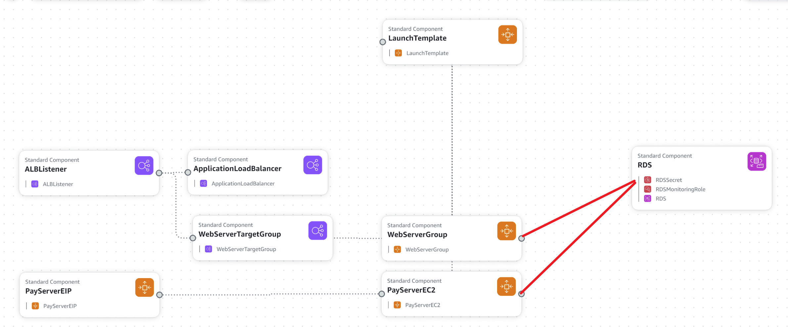

# iac-prototype

An experiment of Infrastructure as Code (IaC) using [AWS CloudFormation](https://docs.aws.amazon.com/cloudformation/).

Simply upload the template to AWS CloudFormation and fill in the desired parameters and you are good to go. AWS CloudFormation will create the stack for you. The result AWS architecture is shown below:

## **Seperation**

The architecture is seperate into 3 comoponents:
- network
- server
- database

**The network component** defines the choice of VPC, subnets and also the SSL certificate for the load balancer. It also defines the security group for the server and database. The seperation allows administrate network without affecting the server and database application development.

**The server component** defines the EC2 instance and the load balancer. The server is a simple php + Apache server that serves a static page. The load balancer is used to deal with https traffic and distribute to the server. It also has another static IP server.

**The database component** defines the RDS instance. The database is a simple Maria SQL database. Peformance Insight is enabled for future peformance monitoring.

## **Collect Detail EC2 Metric**

To collect EC2 metrics for server, you can install cloudwatch agent on the EC2 instance.
Follow the [steps](docs/cloudwatch-agent.md).
